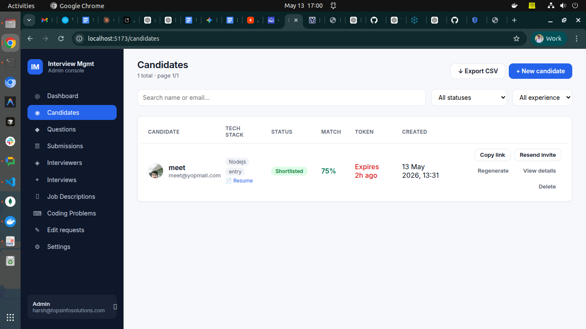
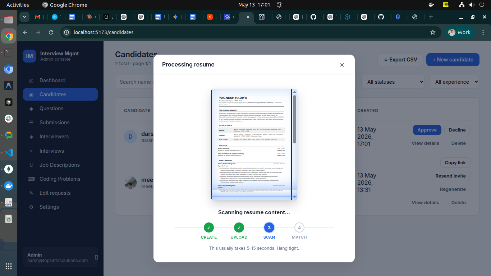
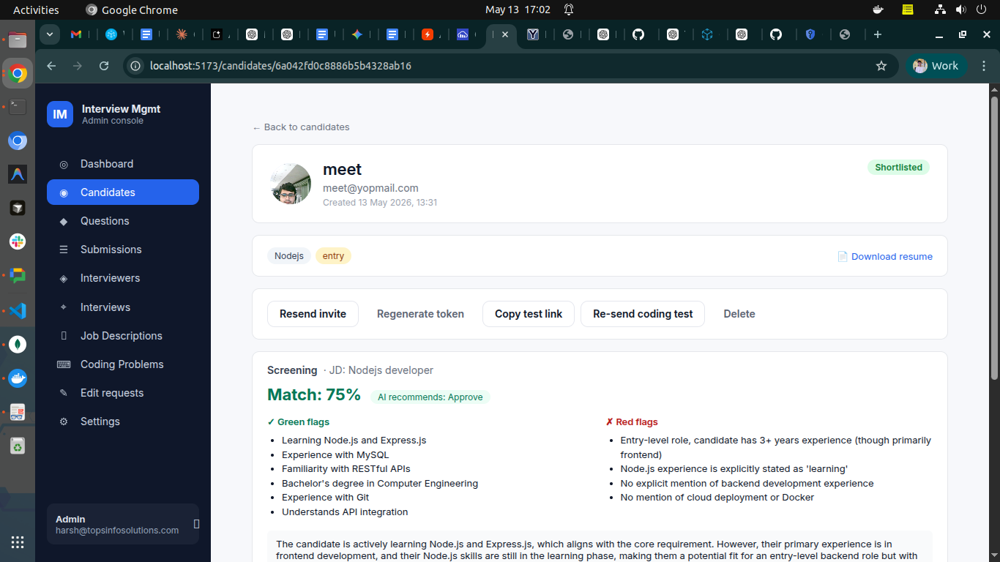
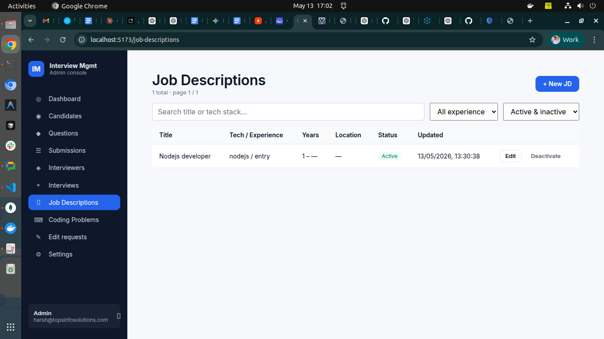
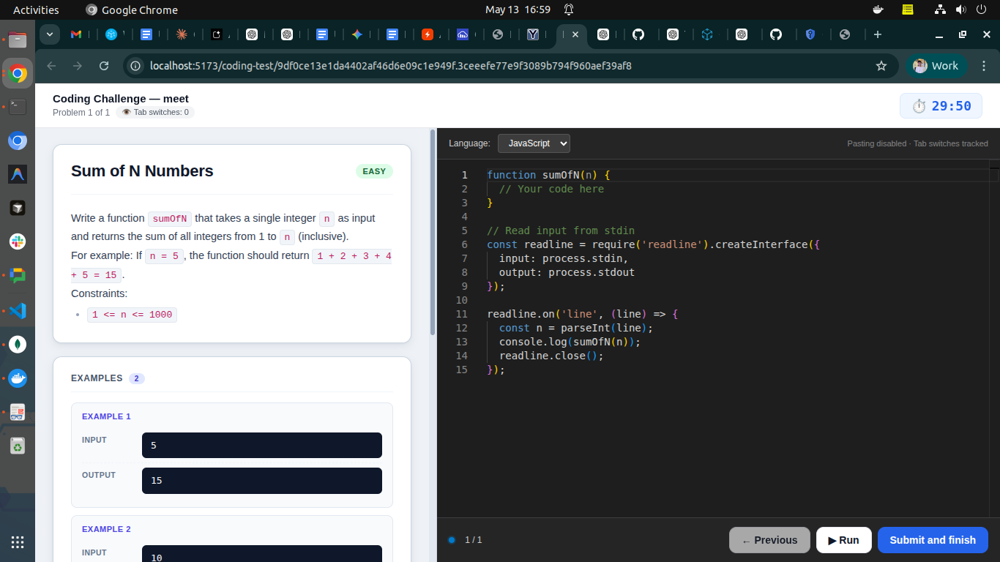
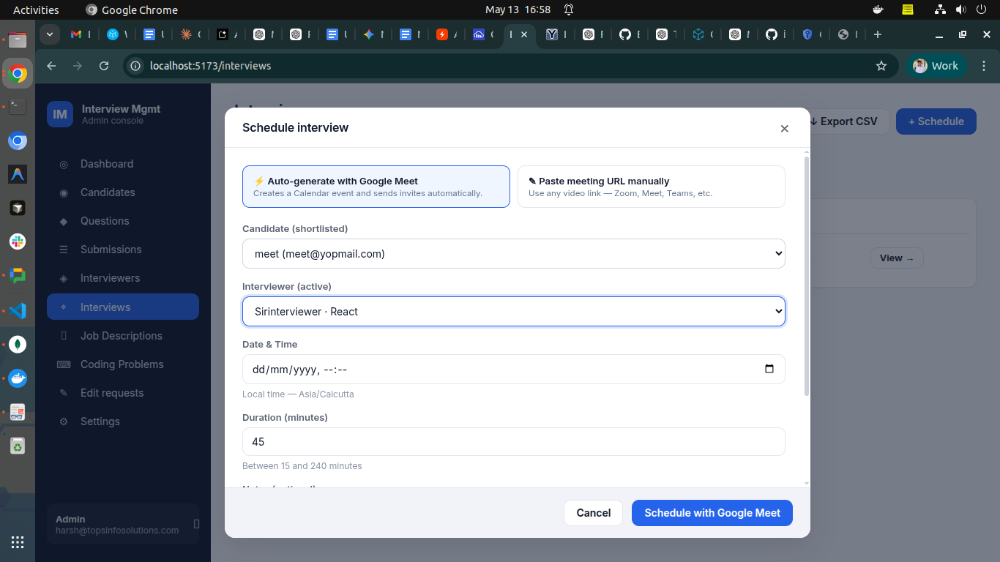
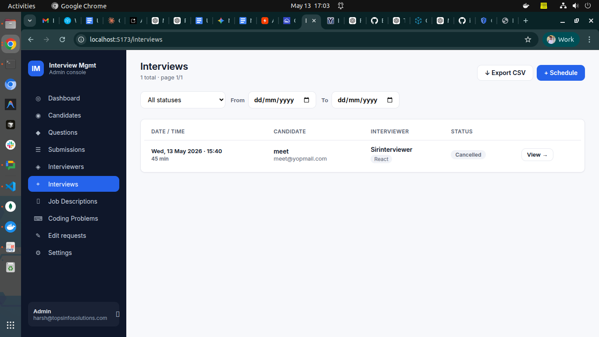
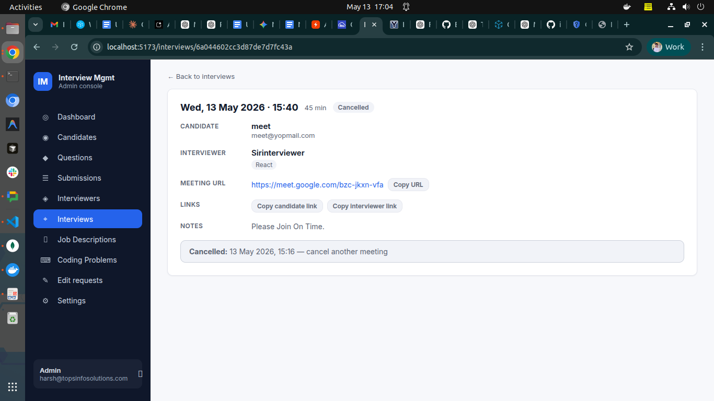
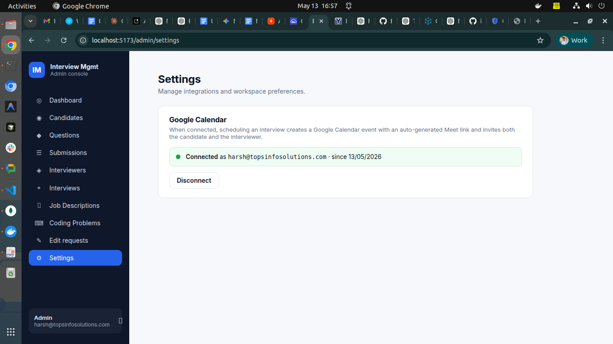

# Interview Management System — Feature Guide

A complete overview of what the system does, who uses each part, and how
a candidate moves from "new application" to "hired or rejected."

> **Note on screenshots:** Drop PNG/JPG images into `docs/screenshots/` using the
> filenames shown below each image placeholder, and they'll render inline when
> this doc is viewed on GitHub.

---

## 1. What this system is

A web-based hiring console that helps HR run the entire interview pipeline
in one place. It replaces the usual spreadsheet + email back-and-forth with:

- A **single dashboard** for managing candidates, tests, interviews, and decisions.
- **AI assistance** for screening resumes, drafting coding problems, and scoring MCQ answers.
- **Automated emails** for every stage (invitations, reminders, shortlist, rejection).
- **Anti-cheat tools** baked into the candidate-facing test pages.
- A clean **interviewer portal** so external interviewers only see what they need.

---

## 2. Who uses it

| Role | What they can do |
|---|---|
| **HR / Admin** | Full access — create candidates, manage questions, schedule interviews, make hire decisions, export data. |
| **Interviewer** | A separate login with access only to interviews assigned to them — review the candidate, submit ratings, and (if needed) request edits to a submitted review. |
| **Candidate** | No login. Receives email links to take tests or join interviews. Each link has a token + expiry. |

---

## 3. The full candidate journey

This is the **happy path** from application to hire decision. Each step is
covered in detail later in the doc.

```
1. HR creates candidate (uploads resume)
        ↓
2. AI scans the resume against a Job Description, returns a Match %
        ↓
3. HR approves or declines the resume
        ↓
4. HR sends the MCQ test link to the candidate
        ↓
5. Candidate takes the timed MCQ test (with photo + anti-cheat)
        ↓
6. AI auto-scores the answers — outcome: Shortlisted / Rejected / Disqualified
        ↓
7. (Optional) HR sends the Coding Test link
        ↓
8. Candidate solves coding problems in an in-browser code editor
        ↓
9. Backend auto-runs the test cases; HR rates the code 1–5 stars
        ↓
10. HR shortlists the candidate → schedules a Round 2 interview
        ↓
11. Interviewer joins on the co-pilot page during the live meeting — AI
    questions, live notes (typed OR voice-transcribed), AI follow-up
    suggestions, optional in-interview coding task
        ↓
12. Interviewer submits a structured review (or HR schedules Round 3 — Practical
    or HR-Culture — and the same flow repeats with prior rounds' context)
        ↓
13. HR reads the review and makes the final hire / culture-round decision
```

---

## 4. Module-by-module breakdown

### 4.1  Candidates

The home base for every applicant.


*`01-candidates-list.png` — the main Candidates list with filters, inline actions, and Export CSV button.*

- **Create a candidate** — name, email, tech stack, experience level, number of MCQ questions, test duration, and an optional resume (PDF / DOC / DOCX up to 5 MB).
- **Resume scanning animation** — when a resume is uploaded, HR sees a live "document scanner" preview of the candidate's resume with a 4-step progress tracker (Create → Upload → Scan → Match) instead of a blank waiting screen.
- **Candidate list page** — searchable, filterable by status / experience, paginated.
  - **Inline quick-actions** per row: Approve / Decline (during resume review), Copy test link, Resend invite, Regenerate token, View details, Delete.
  - **Export CSV** — downloads every candidate matching the current filters: name, email, tech stack, status, resume match %, coding test outcome, and more.

*`02-resume-scan-animation.png` — the live resume scanner animation that runs while uploading + AI screening.*

- **Candidate detail page** — the full profile, with:
  - Avatar, contact, tech-stack chips, experience level, status badge.
  - **Screening panel** — the AI's match %, green flags, red flags, JD title, and AI recommendation. (See §4.3.)
  - **Coding Test summary** card with a button that opens a dedicated review page.
  - **Interview timeline** — a horizontal stepper of every interview round (R1 Technical → R2 Practical → R3 HR-Culture). Each node is color-coded by status (green = completed, blue = scheduled, amber = reschedule pending, hollow gray = cancelled). Click a completed node to expand the interviewer's ratings, comments, and a **View co-pilot notes** link that opens the per-question notes from that round's co-pilot session. A trailing dashed **+ Schedule next round** node appears once the previous round is completed and its review submitted — clicking it opens the schedule modal with the candidate pinned and the next round type pre-selected. The timeline replaces the old single-review block on this page (and is the source of truth for round-by-round history).
  - **Action bar** that adapts to the candidate's stage: Approve, Decline, Send test, Send coding test, Select for culture, Reject, Delete.


*`03-candidate-detail.png` — the candidate detail view showing the screening panel (match %, flags), action bar, and coding test summary.*

### 4.2  Job Descriptions (JD library)

A reusable bank of role descriptions, used by the AI to score resumes.

- HR adds a JD with: title, role, responsibilities, qualifications, nice-to-haves, and a min/max years-of-experience range.
- Each JD is **scoped to a tech stack** (e.g., a "React Developer" JD applies to candidates tagged `react`).
- JDs can be marked active / inactive without deletion.
- When a candidate is created with a matching tech stack, the system automatically picks the right JD for screening.


*`04-job-descriptions.png` — the JD library where HR manages role descriptions.*

### 4.3  AI Resume Screening

Runs automatically when a resume is uploaded for a candidate whose tech
stack has an active JD.

What it produces:
- A **Match %** (0–100) — how well the resume aligns with the JD.
- **Green flags** — specific things the resume gets right (technologies, years of experience, projects).
- **Red flags** — gaps or mismatches (missing skills, wrong experience range, etc.).
- A short **summary** in plain English.
- An **AI recommendation**: Approve or Decline.

HR can:
- **Approve** or **Decline** the resume. Both fire an email to the candidate.
- **Override the AI** — if HR disagrees, a confirmation modal appears warning that the AI recommendation is being overridden.
- **Re-screen** — if the JD changes or the candidate's tech stack is updated, HR can re-run the screening.

The AI uses a **fallback chain** for reliability:
Gemini 2.5-flash → Gemini 2.5-flash-lite → Gemini 2.0-flash → Gemini 2.0-flash-lite → Groq llama-3.3-70b → Groq llama-3.1-8b. If all providers are down, screening is marked `failed` and HR reviews manually.


*`05-ai-screening-panel.png` — the AI screening result on a candidate page (match %, green flags, red flags, recommendation).*

### 4.4  Question Bank

Used to generate the MCQ test.

- Each question has: prompt, options, correct answer, tech stack, difficulty (easy/medium/hard), and source (manual or AI-generated).
- HR can **draft questions with AI** by providing topic + difficulty.
- When HR creates a candidate, the system **samples questions** from the bank that match the candidate's tech stack — using a least-used-first strategy so questions rotate evenly.

### 4.5  MCQ Test (Round 1, the timed assessment)

The candidate receives an email with their test link.

**What the candidate experiences:**
1. Opens the link → **photo capture** step (selfie via webcam) to verify identity.
2. Test page loads with the timer running.
3. Questions appear one by one. Each has options.
4. **Anti-cheat:**
   - Tab switches are tracked and logged.
   - The page is locked into full-screen-like behavior.
   - **3 tab switches → auto-submitted as "Cheated"** (configurable threshold).
   - Photo from the start is stored as evidence.
5. When time runs out (or candidate clicks Submit), answers go to the server.

**What happens on the backend:**
- Answers are **auto-graded** against the bank's correct answers.
- A **percentage score** is computed.
- Based on score + cheat detection, the candidate's status flips automatically:
  - **≥ 60% and no cheat** → `Shortlisted` (eligible for Round 2 or culture round).
  - **< 60%** → `Rejected`.
  - **Cheat detected** → `Cheated` (special status, no email).
- A **score report email** is sent to HR with the breakdown.
- A **result email** is sent to the candidate (different template per outcome).

If a coding test is also pending review, the MCQ auto-outcome is **suppressed** — the final decision waits until both tests are reviewed together.


*`06-mcq-test.png` — the candidate-facing MCQ test with timer and tab-switch tracking.*

### 4.6  Coding Test (optional second-round assessment)

Lets HR evaluate the candidate's coding ability with real programming
problems, runnable in three languages.

**HR side — Coding Problems library:**
- HR builds a bank of coding problems: title, description (markdown), difficulty, tech stack, supported languages (JavaScript / Python / PHP), starter code per language, and test cases (input + expected output, can be marked hidden).
- Each problem can be **AI-drafted** in two ways:
  1. **Generate entire problem** from a topic — AI returns title, description, starter code, and test cases.
  2. **Generate starter code** only — AI scaffolds the stdin/stdout boilerplate for a language.
- Problems can be edited, deactivated, filtered by source (manual / AI), difficulty, language.


*`07-coding-problems-admin.png` — the Coding Problems bank where HR builds and AI-drafts coding problems.*

**Sending the test:**
- On the candidate detail page, HR clicks **Send coding test** → modal asks for: number of problems (1–5), duration (minutes), difficulty.
- System **samples problems** from the bank matching the candidate's tech stack. If the bank doesn't have enough matches, **AI generates new ones on the fly** and saves them to the bank for future use.
- An invite email goes to the candidate with the link.

**Candidate side — the coding test page:**
- IDE-style **split-pane layout** (HackerRank / LeetCode feel):
  - **Left pane**: Problem title, difficulty badge, full description (markdown rendered), example input/output cards in dark terminal style.
  - **Right pane**: VSCode-dark Monaco editor, language picker, starter code pre-loaded.
- **Big timer pill** at the top — turns red and pulses in the last minute. **Auto-submits** when time runs out.
- **Progress dots** at the bottom showing problem 1/3, 2/3, etc.
- **Anti-cheat:**
  - **Paste disabled** in the editor (with a toast warning).
  - **Copy disabled** at the page level.
  - **Right-click / context menu disabled.**
  - **Tab switches counted** — a pill at the top turns amber after 1 switch and red after 3+. A warning modal appears on return.
  - **Tab switch count persists across page refresh** (stored in localStorage).
- Candidate writes solutions for each problem, navigates with Previous/Next, and can click **▶ Run** at any time to test their code against the visible examples — pass/fail per example with input / expected / actual / runtime is shown live. Running does NOT count toward tab-switch tracking and is rate-limited to 30 runs/minute.
- On the last problem, **Submit and finish** sends everything to the auto-grader (including hidden test cases).


*`15-coding-test-run.png` — the coding test page with the new ▶ Run button next to Previous and Submit; candidates can dry-run their code against visible examples before final submission.*


*`08-coding-test-candidate.png` — the IDE-style coding test page with problem on the left and Monaco editor on the right.*

**Auto-execution (server-side):**
- The backend runs candidate code through a **self-hosted Piston instance** (multi-language sandbox running locally as a Docker container — JS / Python / PHP).
- Both the **Run** button (visible examples only) and **Submit** (all cases including hidden) go through the same execution pipeline.
- Each test case runs with the candidate's code as an isolated process; stdout / stderr / exit code / runtime are captured.
- A test case **passes** if `actualStdout.trim() === expectedStdout.trim()` and exit code is 0.
- **Hidden test cases** never appear in the candidate UI, even on Run — so answers can't be hard-coded.

**HR review — the dedicated coding test page:**
- Accessed via the **View coding test submission** button on the candidate detail page (separate route to keep the candidate detail clean).
- Top summary card: sent/submitted dates, outcome pill (Pending review / Shortlisted / Rejected), three stat boxes — test cases passed (with %), tab switches, languages used.
- For each problem:
  - Difficulty badge, language pill, pass-ratio pill.
  - **Test case results** — each case in a card with a green/red border, colored pass/fail icon, Input / Expected / Got blocks (mismatched "Got" shows dark red).
  - **Read-only Monaco editor** showing the candidate's code in VSCode-dark theme.
  - **Re-run tests** button (re-executes against Piston without saving a new submission).
  - **5-star rating** + comment box per problem.
- **Final decision panel** (only when all problems are rated): Shortlist or Reject buttons. Each fires the corresponding Round 1 email to the candidate.


*`09-coding-test-review.png` — the HR review page showing test case results, candidate code, star rating, and shortlist/reject.*

### 4.7  Prompt Engineering Test (optional, AI-evaluated)

A third Round-1 test type — independent of MCQ and Coding — designed to evaluate **prompt-engineering skill**. With AI tools now embedded in every developer workflow, the ability to write a clear, well-scoped prompt is a real hiring signal.

**Flow:**
- HR opens a candidate and clicks **Assign prompt test**. Two paths:
  - **Pick from library** — choose a manually-authored scenario from the Prompt Problems library.
  - **Generate with AI** — the system reads the candidate's resume + AI-screening summary + tech stack + experience level and asks the LLM to draft a scenario tailored to *that specific candidate*. HR previews and can edit any field before saving.
- The candidate gets an email with a link. They open `/prompt-test/<token>`, see the scenario + a sample input, write a prompt, and can optionally click **▶ Try it** up to 5 times to preview the LLM's output against the sample. Then they submit.

**3-step AI evaluation (runs in the background after submit):**
1. **Rubric score (0–50)** — AI grades the prompt itself against a default 5-item rubric (clarity, role/context, output format, examples/constraints, edge-case handling), plus any scenario-specific custom criteria the admin added.
2. **Execute** — the candidate's prompt is run against the sample input via the same Gemini → Groq fallback chain used for resume screening.
3. **Output score (0–50)** — AI checks the produced output against the expected criteria (pass/fail per criterion).

Total score 0–100. HR sees the full breakdown: the candidate's prompt verbatim, the executed LLM output, rubric scores with per-criterion notes, output criteria pass/fail. HR can re-run evaluation if it fails.

**Coexistence with MCQ + Coding:** Independent — HR sends any combination. If any of (coding, prompt) is pending review, the MCQ auto-shortlist is suppressed so HR makes the final call.

**Prompt Problems library** (admin sidebar) is for manually-authored, reusable scenarios. AI-generated problems are stored per-candidate (with `createdFor: candidateId`) and are NOT shown in the library list — they're one-off and personalized.

**Rate limiting:** Preview is capped at 5 runs per test (enforced server-side) plus 10/min/IP HTTP-layer cap to control AI cost.

### 4.8  Interviews (multi-round live meetings)

After Round 1 (MCQ + optional coding + optional prompt test), HR schedules a live interview with a specific interviewer. The same scheduling, reminders, and reschedule machinery support **up to three rounds** in sequence:

| Round | Type | Typical focus |
|---|---|---|
| 1 | **Technical** | Deep technical depth — system design, debugging, framework specifics. |
| 2 | **Practical** | Hands-on problem-solving — pair coding, live debugging, design review. |
| 3 | **HR-Culture** | Soft skills, motivation, team fit, compensation alignment. |

- HR can pick a different interviewer per round (e.g., senior engineer for Technical, hiring manager for HR-Culture).
- The round number auto-increments. A duplicate round-type for the same candidate is blocked at the API level (you can't schedule two "Technical" rounds in a row).
- After each round, HR sees the prior round's review on the candidate detail page before scheduling the next.

**Interviewer management:**
- HR adds interviewers with name, email, and **expertise areas** (e.g., `react`, `node`, `system design`).
- On creation, the interviewer gets an email with a **password setup link** — they pick their own password.
- Interviewers can be marked active / inactive.

**Scheduling an interview:**
- HR opens a shortlisted candidate, clicks **Schedule interview**, picks:
  - An interviewer (filtered by overlapping expertise).
  - Date + time, duration, optional notes for the interviewer.
  - **Two modes** for the meeting link:
    - **⚡ Auto-generate with Google Meet** (default when Google Calendar is connected) — the system creates a real Google Calendar event with a freshly-minted Meet link, invites both candidate and interviewer as attendees, and Google sends them native calendar invitations alongside our custom emails.
    - **✎ Paste meeting URL manually** — fallback for Zoom / Teams / Whereby or when Google isn't connected. The modal automatically falls back to manual mode on any Google failure.
- The system fires two emails simultaneously:
  - **To the candidate**: meeting time, link, interviewer name.
  - **To the interviewer**: candidate summary, meeting time, link, **a magic interviewer-only URL** to load the review form.


*`14-schedule-modal-auto.png` — the Schedule Interview modal showing the new mode toggle. With Google Calendar connected, "⚡ Auto-generate with Google Meet" is selected by default and the submit button reads "Schedule with Google Meet".*

**Interview reminders:**
- A scheduler runs every minute on the backend.
- **30 minutes before** each scheduled interview, it emails BOTH the candidate and the interviewer with a reminder + meeting link.
- A `reminderSentAt` flag prevents double-sends, and it auto-resets if HR reschedules the interview.

**Reschedule flow:**
- Interviewers can request a new time + reason from their portal.
- HR sees a **"Pending reschedule" banner** on the interview detail page with: current time, proposed time, reason.
- HR can **Approve** (reschedule is applied, both parties emailed) or **Reject** (interview stays, interviewer notified). HR can add a decision note.
- **If the interview was auto-generated**, approving a reschedule updates the existing Google Calendar event time too — both attendees get a native "Event updated" notification.
- Full reschedule history is visible per interview.

**Interview detail page (HR view):**
- Top card: schedule time, duration, status badge, candidate + interviewer info, meeting URL with copy button, magic link copy buttons, notes.
- **Action bar**: Edit, Mark complete, Cancel (with reason prompt). Cancelling an auto-generated interview also deletes the underlying Google Calendar event, so attendees get a cancellation notification.
- **Pending reschedule banner** when applicable.
- **Reschedule history** collapsible list.
- **Interviewer review** section (appears once the interview is completed).

**Interview list page:**
- Filter by status / from-date / to-date.
- **Export CSV** — downloads every interview with: time, candidate, interviewer, status, meeting URL, notes, completion details, etc.


*`10-interviews-list.png` — the Interviews list with date filters and Export CSV.*


*`11-interview-detail.png` — an interview detail page showing schedule, links, action bar, and the interviewer review section.*

### 4.9  Live Interview Co-pilot

A real-time companion the interviewer opens during the live Meet/Zoom call. It replaces the old "review form only at the end" flow with an AI-assisted question queue, live note-taking, and an optional in-interview coding task — all in one screen.

**Opening the co-pilot:**
- From the interviewer's interview-detail page, click **Open co-pilot**. A new session is created server-side on first open and resumed on subsequent loads.
- On session start, the AI generates **12 JD-aware questions** seeded from the candidate's resume screening JD snapshot, tech stack, and round type. Questions are returned as a fixed queue — interviewer can change the order by just asking them in the order they prefer.

**The question queue (per card):**
- **Topic chip** (e.g., `React`, `System Design`) + **difficulty pill** (easy / medium / hard, color-coded).
- **Question text** in plain English — phrased as something the interviewer can read aloud.
- **Mark asked** toggle — when ON, the card highlights green and the timer captures the moment the question was asked.
- **Note textarea** — free-form notes about the candidate's answer; debounced and persisted every 1.2s.
- **1–5 star rating** for that specific question.

**Coverage bar** at the top of the queue shows asked / total — a quick visual cue of how far through the queue the interviewer is.

**End interview** flushes any pending updates, ends the session, and routes the interviewer back to the interview detail page. HR can then click **View interview notes** on the candidate detail page to see the full per-question note + rating breakdown in a modal.

#### 4.9.1  Auto voice transcription (zero-typing notes)

To free the interviewer from typing during a conversation, the co-pilot can auto-transcribe notes via the browser's Web Speech API:

- When the interviewer toggles **Mark asked** on a card, the mic auto-starts. A 🔴 **Listening — click to stop** pill appears above the textarea.
- As the interviewer paraphrases the candidate's answer aloud (5–10 words is usually enough), the transcript streams into the note in real time, with proper spacing between sentences and graceful handling of speech pauses.
- The mic auto-stops on the next **Mark asked**, on **Suggest follow-ups**, on **End interview**, on tab-switch / page-hidden, and on toggling the question off.

**Browser support:**

| Browser | Behavior |
|---|---|
| Chrome / Edge / Brave (most Chromium) | Full voice flow works. |
| Safari (some versions) | Works partially; treated as supported, falls back on error. |
| Firefox / others | Voice unavailable — a one-time toast tells the interviewer to type manually. |

**Privacy & limitation:** Audio never leaves the browser — only the final text we already display reaches our backend. The Web Speech API listens to the **system microphone only**; it does NOT capture the candidate's voice coming out of the speakers (Meet/Zoom audio). The interviewer paraphrases aloud to feed the mic. The mic is OFF until the interviewer marks a question, and no audio is ever stored anywhere.

#### 4.9.2  AI follow-up suggestions

After taking notes on an answer, the interviewer can click **💡 Suggest follow-ups** on the question card. The AI returns **2-3 follow-up questions tailored to what's already in the note** — designed to probe deeper into the candidate's answer rather than ask generic textbook questions.

- The 💡 button is disabled when the note is empty (no signal to work from).
- Suggestions render as a read-only bulleted list below the note, in a soft purple-bordered card.
- **↻ Regenerate** asks the AI for a fresh set.
- Suggestions are **not persisted** — they're a coaching aid in the moment, not part of the official record. Each call is stateless and rate-limited.
- Mic auto-stops when the button is clicked so the AI doesn't keep listening while it's working.

#### 4.9.3  In-interview coding task

When the interviewer wants the candidate to write live code during the call, they click **Send coding task** in the co-pilot header:

- A modal asks for: **difficulty** (easy/medium/hard) and **language** (JS / Python / PHP).
- AI **generates a fresh problem on demand** — title, description, starter code, and test cases (one visible sample + a few hidden).
- Backend creates a tokenized link the candidate can open without logging in.
- A **CodingTasksPanel** appears in the co-pilot's right column, showing the new task with status `Sent · waiting`. Interviewer clicks **Copy link** and pastes it into the Meet chat.

**Candidate side** (`/coding-task/:token`):
- IDE-style split-pane like the standalone coding test: problem on the left, Monaco editor on the right.
- Starter code pre-loaded. **▶ Run** dry-runs against visible examples (live pass/fail). **Submit** runs all cases (including hidden) and locks the task.
- Status flips to `Candidate viewing` when the page loads, and `Submitted` once the candidate clicks Submit.

**Interviewer's CodingTasksPanel** (polls every 5s):
- Shows each task with: title, status pill, difficulty pill, language pill, **live tab-switch count badge** (yellow ≥3, red ≥5).
- Once submitted: a **View submission** toggle expands to show the candidate's code, the test-case pass/fail breakdown (Input / Expected / Got / runtime), and the overall passed count.
- **Cancel** is available while the task is pending or opened (turns it to `Cancelled` — candidate sees a clear "Your interviewer cancelled this task" page).

#### 4.9.4  Candidate-side monitoring (in-interview coding task)

The same anti-cheat protections the standalone coding test has are baked into the in-interview coding task page:

- **Paste / copy / right-click blocked** at the page level (including `Ctrl/Cmd+V` and `Ctrl/Cmd+C` keyboard shortcuts). Monaco's own context menu is also disabled.
- **Tab-switch counter** — bumps on every `visibilitychange` to hidden. Visible in the candidate page header as `👁 Tab switches: N` (gray → yellow at 3 → red at 5).
- **Live mirror to the interviewer** — every increment PATCHes the server, and the same badge with the same threshold colors appears next to the task in the CodingTasksPanel. The interviewer can intervene in real time if a candidate is tabbing out repeatedly.
- **Refresh-safe** — count persists across page reloads (localStorage on candidate side, server-side authoritative count for the interviewer).
- Transparent to the candidate: the editor hint reads **"Pasting disabled · Tab switches tracked · Your interviewer will review your submission."** — no surprise enforcement.

### 4.10  Interviewer Portal

A separate dashboard so external interviewers only see their assigned interviews and nothing else.

- **My interviews list** — upcoming + past, with status.
- **Interview detail** — candidate name, resume download (if available), tech stack chips, scheduled time, notes from HR.
- **Review form** — three required 1–5 star ratings:
  - **Knowledge** — technical depth.
  - **Communication** — clarity, articulation.
  - **Confidence** — composure, problem-solving demeanor.
  - Plus a **free-text comments** box.
- **Auto-complete on submit** — submitting the review automatically marks the interview as `completed`, no separate "mark complete" step.
- **Edit-request flow** — if the interviewer wants to amend their review later, they submit an edit request with a reason. HR reviews + approves/rejects with a decision note.


*`12-interviewer-review.png` — the interviewer-side review form with three star ratings and comments.*

### 4.11  Reviews & Edit Requests (HR oversight)

- All interviewer reviews appear on both the **candidate detail page** and the **interview detail page** with: interviewer name, average rating, per-axis stars, comments, submitted-at, edit count.
- **Edit-request center** at `/admin/review-edit-requests` — a queue of pending requests across all interviews. HR can approve or reject each with a note.
- Full **edit history** is shown on the review panel — every previous request, decision, reason, and HR's decision note.

### 4.12  Submissions module

A dedicated browsing view of all MCQ submissions across candidates.

- Filterable, paginated list with score, outcome, cheat status.
- Click into a submission to see: each question, the candidate's answer, the correct answer, per-question evaluation, and the photo captured at the start of the test.

### 4.13  Settings — Integrations

A new admin Settings page (sidebar **⚙ Settings**) holds workspace-level integrations.

**Google Calendar integration:**
- One-click **Connect Google Calendar** — opens Google's standard OAuth consent screen (admin signs in, grants `calendar.events` + email + profile scopes).
- Status panel shows: connected account email, connection date, green dot.
- **Disconnect** removes the stored tokens. Existing interviews keep their meeting links; new interviews will need a manually pasted URL until you reconnect.
- **One shared Google account per workspace** — all admins on the team use the same connected account. The connect/disconnect controls are admin-only.
- **Failure modes** are handled gracefully — if Google access is revoked or the API is unreachable, the system automatically clears the broken integration and the schedule modal falls back to manual-URL mode with a clear banner.


*`13-settings-google-connected.png` — the Settings page with Google Calendar connected. Shows the green "Connected" pill, the account email, the connection date, and the Disconnect button.*

---

## 5. Automation summary

Things that happen without HR doing anything:

| Trigger | What fires |
|---|---|
| Resume uploaded | AI screening starts, match % + flags stored, candidate detail updates. |
| Candidate created without resume | Status set to `resume_pending` (manual approve required). |
| Resume Approved | Email to candidate informing they're shortlisted for the test. |
| Resume Declined | Polite rejection email. |
| Send MCQ test | Email to candidate with timed test link. |
| MCQ submitted | Auto-graded, status flips, score report to HR, result email to candidate. |
| Tab switches exceed threshold | Test auto-submits, status set to `Cheated`. |
| Send coding test | Email with link, problems sampled (or AI-generated). |
| Candidate clicks Run | Code executes against visible examples only via Piston; results shown live. Not persisted. |
| Coding test submitted | All test cases (including hidden) auto-run via Piston, HR notification email with pass/fail count. |
| Coding test Shortlisted | Round 1 shortlist email to candidate. |
| Coding test Rejected | Round 1 rejection email to candidate. |
| Interview scheduled (auto mode) | Google Calendar event created with Meet link; native Google invitations to candidate + interviewer; plus our custom HR-branded emails. |
| Interview scheduled (manual mode) | Two custom emails: candidate + interviewer. |
| 30 min before interview | Reminder emails to candidate + interviewer. |
| Interview rescheduled (auto mode) | Calendar event time patched on Google; both attendees get "Event updated" notification + our reschedule emails. |
| Interview rescheduled (manual mode) | Re-fired notifications to both parties; reminder flag reset. |
| Reschedule approved/rejected | Notification to interviewer with HR's decision note. |
| Interview cancelled (auto mode) | Google Calendar event deleted; attendees get cancellation notification + our cancellation email. |
| Interviewer opens co-pilot | AI generates 12 JD-aware questions for that session (cached for resume). |
| Interviewer toggles "Mark asked" | Mic auto-starts (Web Speech API); transcript streams into the question's note. |
| Interviewer clicks 💡 Suggest follow-ups | Mic stops; AI returns 2-3 tailored follow-up questions based on the current note. |
| Interviewer ends interview | All pending notes/ratings flushed; session marked ended; mic released. |
| Interviewer sends in-interview coding task | AI generates a problem on demand; tokenized link surfaces in CodingTasksPanel. |
| Candidate switches tab during in-interview coding task | Count PATCHed to server; interviewer's panel badge updates within 5s. |
| Candidate submits in-interview coding task | All test cases run via Piston; results visible inline in CodingTasksPanel. |
| Interviewer submits review | Interview auto-completed. |
| HR shortlists for culture / rejects | Final-stage email to candidate. |

---

## 6. Anti-cheat measures

Both the MCQ test and the coding test have layered protections:

**MCQ test:**
- **Photo capture** before the test starts — stored as visual proof.
- **Tab-switch counter** — N switches → auto-submit with `Cheated` status.
- **Server-side timer enforcement** — even if a candidate fakes the client clock, the backend tracks the real elapsed time.
- **Single-use token** — once submitted, the link can't be reused.
- **Token expiry** — links expire 24 hours after issue.

**Coding test:**
- **Paste blocked** in the Monaco editor (toast warning shown).
- **Copy / Cut blocked** at the page level (Ctrl/Cmd + C/V/X intercepted).
- **Context menu disabled** (no right-click).
- **Tab-switch counter** with a visible amber/red pill that updates live; HR sees the final count on the review page.
- **Tab-switch count persists across refresh** (localStorage, keyed by token).
- **Auto-submit on timer expiry**.
- **Test cases run server-side only** — candidate code never executes in the browser.
- **Hidden test cases** that the candidate never sees, so the answers can't be hard-coded.

**In-interview coding task** (same protections, plus real-time visibility for the interviewer):
- All four candidate-side blockers above (paste, copy/cut, context menu, tab-switch counter persisting through refresh).
- **Live count mirrored to the interviewer** — every tab-switch PATCHes the server and the count appears next to the task in the co-pilot's CodingTasksPanel (gray → yellow at 3 → red at 5), so the interviewer can intervene during the call.
- **Hidden test cases** still enforced; same Piston-backed execution pipeline.

---

## 7. Reporting & data export

- **CSV export from the Candidates page** — every column needed for offline reporting (name, email, tech stack, status, match %, coding outcome, dates, links).
- **CSV export from the Interviews page** — schedule, candidate, interviewer, status, meeting URL, completion details, cancel reasons.
- Both exports **respect the current filters** — so if you've filtered "Status = Shortlisted", only those rows are exported.
- Files open cleanly in Excel / Google Sheets (UTF-8 BOM + Excel-friendly escaping).

---

## 8. Quick reference — where to find what

| Need to… | Go to |
|---|---|
| Add a new candidate | Candidates → **+ New candidate** |
| See AI's match % for a candidate | Candidates → click candidate → Screening panel |
| Approve / Decline a resume | Candidates list (inline) or candidate detail page |
| Send the MCQ test | Candidate detail page → **Send test** (after resume approved) |
| See an MCQ submission | Submissions → click row |
| Build the question bank | Questions → **+ New question** or **AI generate** |
| Create / edit a JD | Job Descriptions → **+ New JD** |
| Build a coding problem | Coding Problems → **+ New problem** (manual or AI) |
| Send the coding test | Candidate detail page → **Send coding test** |
| Review coding submission | Candidate detail → **View coding test submission** |
| Add an interviewer | Interviewers → **+ New interviewer** |
| Schedule an interview | Candidate detail (after shortlisted) → **Schedule interview** |
| Approve a reschedule request | Interview detail → Pending reschedule banner |
| Run the live co-pilot during a meeting | Interviewer Portal → interview detail → **Open co-pilot** |
| Send a coding task during the interview | Co-pilot → **Send coding task** (top bar) → copy link into chat |
| See AI follow-up suggestions for a question | Co-pilot → question card → **💡 Suggest follow-ups** |
| Use voice instead of typing notes | Co-pilot → toggle **Mark asked** — mic auto-starts; paraphrase aloud |
| See the candidate's tab-switch count on the in-interview coding task | Co-pilot → **CodingTasksPanel** (right column) — live badge per task |
| Read all questions/notes/ratings after a session | Candidate detail → expand the round in the **Interview timeline** → **View co-pilot notes** |
| See a candidate's round-by-round interview history | Candidate detail → **Interview timeline** (stepper near the bottom) |
| Schedule Round 2 (Practical) or Round 3 (HR-Culture) | Candidate detail → **Interview timeline** → **+ Schedule next round** (visible only when the prior round is completed and reviewed) |
| See an interviewer's review | Candidate detail OR Interview detail |
| Approve a review edit request | Admin → **Edit requests** |
| Export everything | Candidates / Interviews → **↓ Export CSV** |
| Connect Google Calendar (auto-generate Meet links) | Settings (⚙ in sidebar) → **Connect Google Calendar** |

---

## 9. Tech stack (for IT / dev reference)

- **Backend**: Node.js, Express, MongoDB (Mongoose), Joi validation, Jest tests.
- **Frontend**: React, Redux Toolkit, Vite, SCSS, React Router, Monaco editor.
- **AI providers**: Google Gemini (primary, multiple model tiers) → Groq (fallback) for resume screening, MCQ grading, question drafting, problem drafting.
- **Code execution**: **Self-hosted Piston** (Docker — `ghcr.io/engineer-man/piston` on port 2000) — runs JS / Python / PHP in isolated sandboxes. URL is configurable via `PISTON_URL` env var so the same code can target a remote/managed Piston in production.
- **Calendar integration**: Google Calendar API + Meet, via OAuth 2.0 with `googleapis` Node SDK. Tokens stored in a singleton `GoogleIntegration` Mongo document. Token refresh + CSRF-signed OAuth state handled in the backend.
- **Email**: SMTP via Nodemailer.
- **File storage**: Cloudinary (resumes, photos).
- **Auth**: JWT with role claims (admin / interviewer), token-based public links for candidates.
